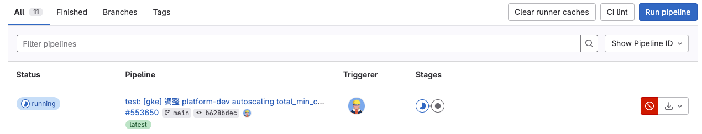
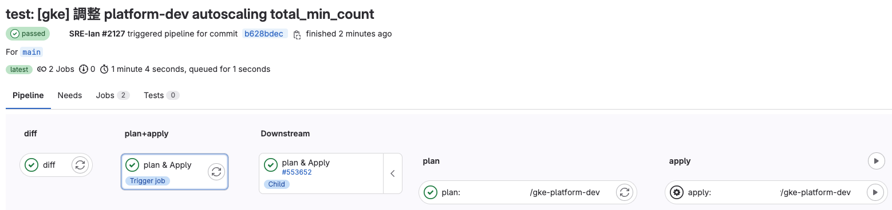
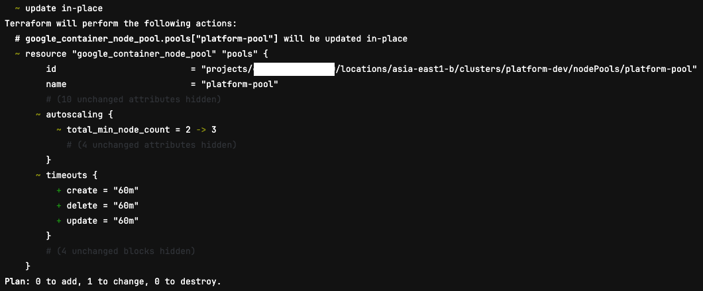
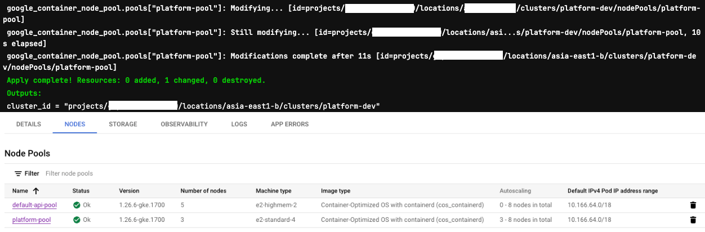
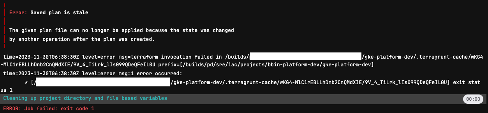
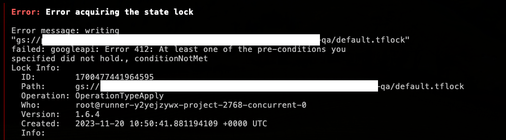

# IaC

此專案是用 IaC (Terraform + Terragrunt) 來管理 GCP 相關資源以及服務，並透過 GitLab CI/CD 來進行自動化部署。

<br>

## 前情提要

1. 此專案的 IaC Module 有參考官方的 Module 改寫，有將一些自己不常用到的設定給拔掉，所以不是所有設定都在上面，如果有需要的話，可以自行參考官方的 Module 來改寫。
2. 要使用此專案，請先確定版本是否符合 Module 所規定的版本，如果版本不符合，請自行升級。
3. 請先檢查所有腳本或是設定，將以下參數 `[專案名稱]`、`[專案ID]`、`[專案地區]`都改成自己的設定，才能正常使用。
4. 其餘沒有調整或寫出的內容，歡迎開 PR 來補充，謝謝。

<br>

# 使用版本

- Terraform : v1.5.7
- Terragrunt : 0.53.4
- GitLab : 16.3

<br>

## 文件目錄

- [IaC 介紹](https://github.com/880831ian/IaC/blob/master/docs/iac-introduce.md)
- [IaC 架構](https://github.com/880831ian/IaC/blob/master/docs/iac-introduce.md)
- [IaC CICD 架構](https://github.com/880831ian/IaC/blob/master/docs/iac-cicd-framework.md)
- [IaC 匯入、轉換腳本介紹](https://github.com/880831ian/IaC/blob/master/docs/iac-import-conversion-scripts.md)
- [IaC 備注](https://github.com/880831ian/IaC/blob/master/docs/iac-remark.md)

<br>

為了方便閱讀，README 只會放 IaC 的使用教學，其餘的會收錄在 docs 資料夾中，請直接點上方目錄對應的連結。

<br>

## IaC 使用教學

從 [IaC CICD 架構](https://github.com/880831ian/IaC/blob/master/docs/iac-cicd-framework.md) 了解 IaC 的 CICD 架構後，接下來就可以開始使用 IaC 😉。

<br>

(以下都會用 `[專案名稱]`、`[資源]` 來代替實際的專案名稱、資源，請大家自行替換)

首先，假設我們要調整 `[專案名稱]` 專案的 gke 資源，那你需要完成以下的幾個步驟：

1. 先進入 projects 資料夾，再進到 `[專案名稱]` 專案資料夾，如下：

```
.
├── gke-XXX
│   ├── import.sh (這個只有 GKE 才有，詳細可以參考 IaC 匯入、轉換腳本介紹)
│   └── terragrunt.hcl
└── terragrunt.hcl
```

(此範例是 GKE 資源，其他資源也是類似，只要進到對應資源的資料夾即可，例如：gke-XXX、gce-XXX、filestore-XXX)

<br>

2. 在 `[專案名稱]` 專案底下會先看到一個 terragrunt.hcl 檔案，該檔案會將 iac 管理的 tfstate.tf backend 的設定寫在這，詳細可以參考 [Terraform 如何多人共同開發 (將 tfstate 存在後端)](https://blog.pin-yi.me/terraform-tfstate/)，以及一些共用變數，`project_id`、`network_project_id`，這種整個專案都可以使用的變數就可以放在這邊。

<br>

3. 接著我們打開要調整的 gke 資源，例如：gke-XXX，裡面會有一個 import.sh 的腳本，該腳本使用說明，請參考 [IaC 匯入、轉換腳本介紹](https://github.com/880831ian/IaC/blob/master/docs/iac-import-conversion-scripts.md)，以及 terragrunt.hcl 的設定檔案：

```
  .... (省略) ....

inputs = {
  name                   = "platform-dev"
  zones                  = ["asia-east1-b"]
  release_channel        = "REGULAR"
  master_ipv4_cidr_block = "172.16.0.48/28"

  .... (省略) ....

  node_pools = [
    {
      name            = "platform-pool"
      machine_type    = "e2-standard-4"
      disk_type       = "pd-standard"
      total_min_count = 2
      total_max_count = 8
    },
    {
      name            = "default-api-pool"
      machine_type    = "e2-highmem-2"
      disk_type       = "pd-standard"
      total_min_count = 0
      total_max_count = 8
    }
  ]

  .... (省略) ....
}
```

(terragrunt.hcl 的設定檔案詳細說明，可以參考 template 資料夾中不同資源的範例來填寫)

<br>

4. 接著，假設我們現在想調整 platform-pool 的 autoscaling total_min_count，將 2 調整成 3，將 MR merge 到 main 分支，並觸發 CICD 流程 (只有異動 [資源類型]-[資源名稱] 資料夾底下的 terragrunt.hcl 會才觸發 )，詳細請參考 [IaC CICD 架構](https://github.com/880831ian/IaC/blob/master/docs/iac-cicd-framework.md)。



<br>

5. 跑完後的 pipeline 會長得像以下，我們主要查看 plan 以及 apply job 即可，其餘詳細請參考 [IaC CICD 架構](https://github.com/880831ian/IaC/blob/master/docs/iac-cicd-framework.md)



<br>

6. 我們先點擊 plan 的 job 按鈕，裡面會顯示這次異動的內容：



<br>

7. 請檢查一下，是否與你想要調整的設定相同，如果沒問題，就可以點 apply 的按鈕，進行異動，<b>但如果有出現任何的紅字、或是 destroy</b>，請雙手舉高，呼叫支援，千萬別執行 apply：


(感謝提供照片 @BingweiLai )

<br>

8. 當 apply 的 job 有順利完成後，可以到 GCP 頁面上查看是否有異動成功，就完成 IaC 的調整囉 🎉🎉。



<br>

9. 最後，如果 plan 完成後，發現有錯誤，請重新推新的 commit，從跑第四點的流程。另外，如果已經 apply 後，再重新點舊的 apply job 按鈕會出現錯誤，意思是狀態已經改變，所以不用擔心不小心點到 apply。



<br>

10. 上版控跑 CICD 前，可以先把專案 Clone 到本地跑，由於在執行 plan 以及 apply 時，會鎖檔，如果出現以下圖片錯誤，就代表正在有人測試相同資源，可以稍等一下再試試看：


