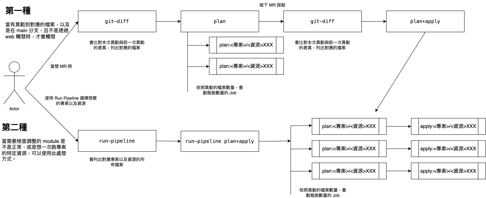
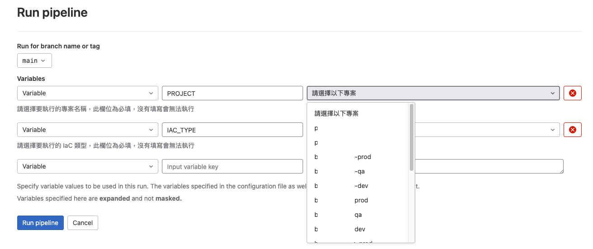
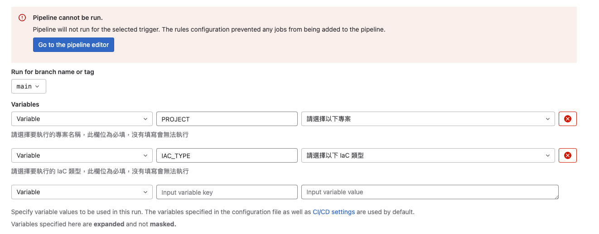

# IaC CICD 架構

此專案的 CICD 有兩種方式觸發方式，第一種是最常會使用到的異動檔案時觸發，另一種是當有調整 Module 時，可以用來檢查，所有專案與資源是否正常。

需請申請一個服務帳戶，並將服務帳戶的金鑰放入 GitLab 參數 ACCOUNT_KEY 中，記得要有操控這些資源的權限。

<br>

可以先簡單看一下整個 CICD 流程圖，後面會再詳細一點說明程式部分



圖片檔案：https://app.diagrams.net/?src=about#G1ZZtRnQepaS-YEynCOoKX7NdfU2_tD-P3

<br>

## 第一種

當有異動到 projects/`<專案名稱>`/`<資源類型>`-`<資源名稱>`/terragrunt.hcl 檔案，以及分支必須為 main、且不是由 Run pipeline 執行的，再發 MR 的當下，就會觸發 .gitlab-ci.yml 裡面的 `git-diff` 跟 `plan` 兩個 job，當檢查完成後，按下 MR 按鈕後，會重新跑一次 `git-diff` 跟 `plan & apply`。

<br>

- .gitlab-ci.yml ( `git-diff` 、`plan`、`plan & apply` ) job

```
stages:
  - git-diff
  - plan
  - plan+apply

default:
  tags:
    - ahkui-test

.reference:
  common_rules:
    - if: $CI_COMMIT_BRANCH == "main" && $CI_PIPELINE_SOURCE != "web"
      changes:
        - "projects/**/**/terragrunt.hcl"
  plan_rules:
    - if: $CI_PIPELINE_SOURCE == "merge_request_event"
      changes:
        - "projects/**/**/terragrunt.hcl"

git-diff:
  stage: git-diff
  script:
    - LAST_COMMIT_SHA=$(git rev-parse HEAD~1)
    - CHANGED_FILES=$(git diff --name-only ${LAST_COMMIT_SHA} ${CI_COMMIT_SHA} -- ${CI_PROJECT_DIR}/projects/)
    - echo "$CHANGED_FILES"
    - PROJECT_URL=$(echo "$CHANGED_FILES" | awk -F'/' '/projects\/[^\/]+\/.*\/terragrunt\.hcl/{print $2"/"$3}' | sort | uniq)
    - PROJECT_URL=$(echo $PROJECT_URL | sed 's/ /,/g')
    - apk add --no-cache bash 1>/dev/null
    - |
      if [ "$CI_PIPELINE_SOURCE" == "merge_request_event" ]; then
        ./generate_job.sh ${PROJECT_URL} plan
      else
        ./generate_job.sh ${PROJECT_URL}
      fi
    - echo ${PROJECT_URL}
  rules:
    - !reference [.reference, common_rules]
    - !reference [.reference, plan_rules]
  artifacts:
    paths:
      - job.yml
    expire_in: "3600"

plan:
  stage: plan
  rules:
    - !reference [.reference, plan_rules]
  trigger:
    include:
      - artifact: job.yml
        job: git-diff
    strategy: depend

plan & apply:
  stage: plan+apply
  rules:
    - !reference [.reference, common_rules]
  trigger:
    include:
      - artifact: job.yml
        job: git-diff
    strategy: depend
```

`git-diff` 會先比對本次異動與前一次異動內容，並取得異動的檔案路徑，例如：`<專案名稱>`/`<資源類型>`-aaa，如果有多個異動時，則會用 , 來區分，例如：`<專案名稱>`/`<資源類型>`-aaa,`<專案名稱>`/`<資源類型>`-bbb,`<專案名稱>`/`<資源類型>`-ccc ，並將其字串帶入 ./generate_job.sh 腳本，如果是發 MR 觸發的 git-diff 會帶 plan 參數，代表只需要動態產生 plan 的 job 即可。

`plan` 會顯示 ./generate_job.sh 所產生的動態 plan 子 job。

`plan & apply` 會顯示 ./generate_job.sh 所產生的動態 plan、apply 子 job。

<br>

- generate_job.sh

```
#!/bin/bash

generate_status=${2}

echo "stages:
 - plan
 - apply

default:
  image:
    name: alpine/terragrunt
  tags:
    - ahkui-test

before_script:
  - unset GOOGLE_APPLICATION_CREDENTIALS
" >job.yml

generate_plan_job() {
  PROJECT_URL="$1"
  PARENT_PIPELINE_ID="$2"
  echo "plan:${PROJECT_URL}:
  stage: plan
  script:
    - cd projects/${PROJECT_URL}
    - terragrunt validate
    - terragrunt refresh
    - terragrunt plan -out=tfplan
  artifacts:
    paths:
      - projects/${PROJECT_URL}
    expire_in: \"3600\"
  rules:
    - if: '\$CI_PIPELINE_SOURCE == \"parent_pipeline\"'
  " >>job.yml
}

generate_apply_job() {
  PROJECT_URL="$1"
  PARENT_PIPELINE_ID="$2"
  echo "apply:${PROJECT_URL}:
  stage: apply
  script:
    - cd projects/${PROJECT_URL}
    - echo 'y' | terragrunt apply tfplan
  dependencies:
    - plan:${PROJECT_URL}
  when: manual
  " >>job.yml
}

IFS=',' read -ra PROJECT_URLS <<<"$1"
for PROJECT_URL in "${PROJECT_URLS[@]}"; do
  if [ "${generate_status}" == "plan" ]; then
    generate_plan_job "$PROJECT_URL" "$PARENT_PIPELINE_ID"
  else
    generate_plan_job "$PROJECT_URL" "$PARENT_PIPELINE_ID"
    generate_apply_job "$PROJECT_URL" "$PARENT_PIPELINE_ID"
  fi
done
```

腳本會先執行 55、57 ~ 58 行 行，將剛剛的異動的檔案路徑傳入 PROJECT_URLS，並分別帶入 `generate_plan_job`、`generate_apply_job` function 中執行。(如果有帶 plan 參數，只會帶入 `generate_plan_job` function)

接著就會依照帶入的 PROJECT_URLS 自動產生 `plan` Job 以及 `apply` Job。

`plan` Job 主要是檢查 terragrunt 格式是否正確、執行 refresh 確保 `plan` 內容與線上資源一致、以及使用 `plan` 來顯示 IaC 的異動，並將執行狀態存到 tfplan 中 (會透過 artifacts 來儲存)。

`apply` Job 則必須先等到對應的 `plan` Job 執行完產生 artifacts，透過 dependencies 讓 `apply` Job 可以使用 (`apply` Job 需要手動觸發)，當手動點擊按鈕後，則會直接執行 terragrunt apply tfplan ，將 `plan` 顯示異動的內容給執行。

<br>

## 第二種

當我們有調整 Module 時，想要檢查一下設定，會不會因為異動 Module 而導致出
現錯誤，或是希望大量的跑過特定專案的資源時，可以使用 pipelines 頁面的 Run pipeline 來選擇要跑的專案以及資源名稱：



<br>

PROJECT 以及 IAC_TYPE 選項都是必選，若沒有選擇，則會跳出以下錯誤：



<br>

當選擇完成後，則會開始跑對應的專案以及資源 CICD

- Run pipeline 的相關 CI

```
stages:
  - run-pipeline
  - run-pipeline plan & apply

.reference:
  run_pipeline_rules:
    - if: $CI_PIPELINE_SOURCE == "web" && $PROJECT != "請選擇以下專案" && $IAC_TYPE != "請選擇以下 IaC 類型"
      when: on_success
      allow_failure: false

variables:
  PARENT_PIPELINE_ID: ${CI_PIPELINE_ID} # 將父流程的 CI_PIPELINE_ID 傳給子流程
  PROJECT:
    value: "請選擇以下專案"
    options:
      - "請選擇以下專案"
      - "<專案名稱>"
    description: "請選擇要執行的專案名稱，此欄位為必填，沒有填寫會無法執行"
  IAC_TYPE:
    value: "請選擇以下 IaC 類型"
    options:
      - "請選擇以下 IaC 類型"
      - "cloud-armor"
      - "filestore"
      - "gce"
      - "gce-group"
      - "gcs"
      - "gke"
      - "ip"
      - "lb-internal"
      - "memorystore"
    description: "請選擇要執行的 IaC 類型，此欄位為必填，沒有填寫會無法執行"
```

最上面有兩個我們用來設定 PROJECT、IAC_TYPE 的設定，有預設值以及可選的變數， 預設值是選擇的文字提示，因為有判斷，所以沒有選，才會無法執行。

<br>

```
run-pipeline:
  stage: run-pipeline
  script:
    - echo "執行專案名稱：${PROJECT} / IaC 類型：${IAC_TYPE}"
    - PROJECT_URL=$(ls -d projects/${PROJECT}/${IAC_TYPE}-*)
    - PROJECT_URL=$(echo $PROJECT_URL | sed 's/projects\///g' | sed 's/ /,/g')
    - apk add --no-cache bash 1>/dev/null
    - ./generate_job.sh ${PROJECT_URL}
    - echo ${PROJECT_URL}
  rules:
    - !reference [.reference, run_pipeline_rules]
  artifacts:
    paths:
      - job.yml
    expire_in: "3600"

run-pipeline plan & apply:
  stage: plan+apply
  rules:
    - !reference [.reference, run_pipeline_rules]
  trigger:
    include:
      - artifact: job.yml
        job: run-pipeline
    strategy: depend
```

<br>

`run-pipeline` 、`run-pipeline plan & Apply` 兩個 Job，必須符合使用 Run pipeline 執行，以及必須選擇不是請選擇以下專案、請選擇以下 IaC 類型的文字提示才可以觸發

`run-pipeline` Job 會先印出選擇的專案及 IaC 類型，接著將對應專案的 IaC 類型資料夾給列出來

跟 `git-diff` 一樣，把資料夾變成字串，再將其字串帶入 `./generate_job.sh` 腳本，並帶入 `run-pipeline`。

`run-pipeline plan & Apply` Job 會跑跟上面的 `plan & Apply` 差不多，只是觸發方式不同。
