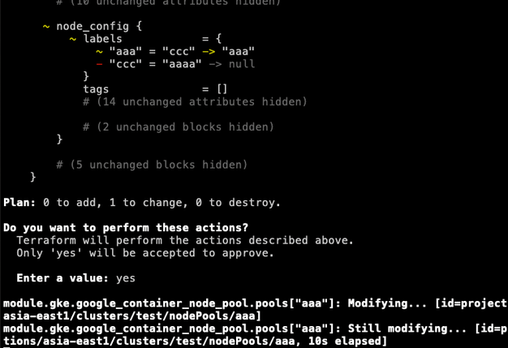
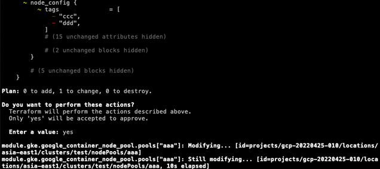
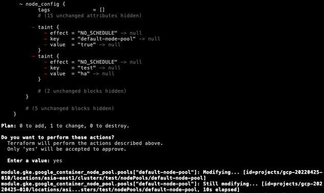
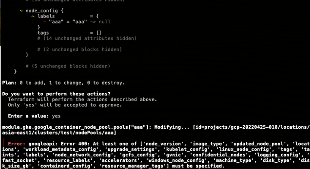

# IaC 遇到的問題與解決辦法

## GKE

Q1：為什麼 node_pool 的 labels 移除會出現以下 400 錯誤？

`googleapi: Error 400: At least one of ['node_version', 'image_type', 'updated_node_pool', 'locations', 'workload_metadata_config', 'upgrade_settings', 'kubelet_config', 'linux_node_config', 'tags', 'taints', 'labels', 'node_network_config', 'gcfs_config', 'gvnic', 'confidential_nodes', 'logging_config', 'fast_socket', 'resource_labels', 'accelerators', 'windows_node_config', 'machine_type', 'disk_type', 'disk_size_gb', 'containerd_config', 'resource_manager_tags'] must be specified.`

A1：目前查看，應該是 TF 的 BUG，也有人遇到類似情形，可以參考：https://github.com/hashicorp/terraform-provider-google/issues/15848

有另外測試幾種形況：

1. 是否可以正常新增、修改、刪除(不是全部)的 node_pool labels：可以

 

2. 其他的 tags、taint 是否也會有一樣的問題：不會 (都可以正常動作)

 

 

所以只有當全部刪除 node_pool 的 labels 才會噴錯

 

## GCE (包含 IP)

Q1 : 假設目前已經有建立名為 test 的內網 IP，其他 VM 建立時，使用到相同的 test 名稱或是 IP，會出現什麼錯誤嗎？

A1：如果使用已經保留的名稱，會出現 409 googleapi Error，說名稱已存在，如果是使用相同 IP，則會出現該 Address IP 已存在的錯誤訊息。

 

Q2：如果我想更改已保留的 IP 名稱，可以嗎？有什麼前提嗎？

A2：在 GCP UI 上無法調整，但使用 TF 可以，前提是該 IP 必須是被 Use 的狀態 (異動時，IP 也需要設定要異動的 IP)，且 TF 需要有設定 IP Address，才可以調整保留 IP 的名稱(不管內外網)，如果尚未被 Use，就算有保留，一但調整名稱，該 IP 就會被釋放掉，這點要十分小心。

 

Q3：如果我想要更換已保留的內部 IP，可以嗎？

A3：不行，因為 VM 會咬住已保留的內部 IP，所以就算調整 IP 也沒有辦法。

 

Q4：如果我想要更換已保留的外部 IP，可以嗎？

A4：可以，只不過需要先將 nat_ip_enabled 改成 false (把 external_ip_address 註解也可以)，讓舊的外部 IP 刪掉，再重新開啟 nat_ip_enabled true，重新建立並保留 IP，目前沒辦法直接在設定，直接填寫其他已保留的外部 IP (但用 GCP UI 可以，但如果使用 UI 調整，舊的 TF 會壞掉，需要重新 import TF)。

 

## LB-INTERNAL

Q1 : 假設目前已經有建立名為 aaa 的 IP，其他 lb 建立時，使用到相同的 aaa 名稱或是 IP，會出現什麼錯誤嗎？

A1：如果使用已經保留的名稱，會出現 409 googleapi Error，說名稱已存在，如果是使用相同 IP，則會出現該 Address IP 已存在的錯誤訊息。

 

Q2：如果我想更改已保留的 IP 名稱，可以嗎？有什麼前提嗎？

A2：在 GCP UI 上無法調整，但使用 TF 可以，前提是該 IP 必須是被 Use 的狀態 (異動時，IP 也需要設定要異動的 IP)，且 TF 需要有設定 IP Address，才可以調整保留 IP 的名稱，如果尚未被 Use，就算有保留，一但調整名稱，該 IP 就會被釋放掉，這點要十分小心。

 

Q3：如果我想要更換已保留的內部 IP，可以嗎？

A3：可以，只要指定的 IP，尚未被使用就可以了
